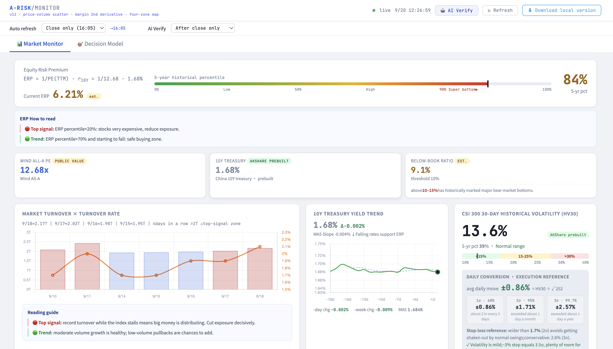

# A-Share Risk Monitor · A-RISK/MONITOR

> English · [中文](README.zh-CN.md)

A locally run risk dashboard for the Chinese A-share market. It answers one question: **how risky is the market right now, and how much exposure makes sense?** It does not pick stocks.

Built entirely with AI, with no hand-written code.



> 📊 More screenshots: [ETF flows by category](docs/screenshot-flows.png) · [two-layer decision model](docs/screenshot-decision.png)

> ⚠️ For research and learning only. Nothing here is investment advice.

## What it tracks

Equity risk premium (ERP), Wind All-A PE, China 10Y treasury yield, below-book ratio, market turnover × turnover rate, CSI 300 HV30 volatility, credit impulse (1st derivative of total social financing stock YoY), margin balance + momentum, ETF flows by category, and a Shenwan Level-1 sector heatmap.

## The decision model

The model was not designed up front. Every candidate indicator was backtested against actual market performance (2016–2026), and the survivors were sorted by how early they signal. That produced two layers:

| Layer | Question | Inputs |
|---|---|---|
| **Layer 1 · Strategic Warning** | Is credit expanding or contracting? Sets the direction, not the timing. | Credit impulse; 2 consecutive months of the same sign confirms the state |
| **Layer 2 · Safety Margin** | How expensive and how crowded is the market? Sets the size of the safety cushion. | ERP percentile (55%) + turnover percentile (45%), shown as a scatter plot |

A third layer (margin Z-score, HV30 percentile) was meant to time exact entry days. The backtest showed no predictive power and adding it made the combined model worse, so it stays on the dashboard for observation only and plays no part in decisions.

**Layer 1 sets direction. Layer 2 sets the cushion. The reference layer is only there to look at.**

## Files

| File | Purpose |
|---|---|
| `arisk_monitor_local.html` | The dashboard (Chart.js via CDN, everything else inline) |
| `update_arisk_data.py` | Fetches all data → writes `arisk_data.json` (~95s) |
| `proxy.py` | Local proxy on 8899 for live browser fetches + Miaoxiang API forwarding |
| `check_and_update.sh` | Updates only if data is behind the latest trading day |
| `run_arisk_update.sh` | Runs one update (called by check, or manually) |
| `start.sh` / `stop.sh` | Start/stop the proxy (8899) and static server (8788) |
| `arisk_data.json` | Data snapshot (seed data; refreshed by any update run) |

## Quick start

```bash
git clone https://github.com/zhysh3/a-share-monitor-en.git arisk
cd arisk

# 1. Create a virtualenv and install dependencies (Python 3.9+)
python3 -m venv venv
./venv/bin/pip install -r requirements.txt

# 2. (Optional) add a Miaoxiang API key; works without it
cp .env.example .env

# 3. First data fetch
./venv/bin/python update_arisk_data.py

# 4. Start and open the dashboard
bash start.sh
```

Dashboard: <http://localhost:8788/arisk_monitor_local.html>

> ⚠️ **Open it through `start.sh` (local http), not by double-clicking the HTML.** Browsers block reading local JSON over `file://` and the page will be empty.

Stop: `bash stop.sh`

## Daily auto-update

Data is published **after the close on trading days (from ~18:00 Beijing time)**. `check_and_update.sh` exits immediately if data is current and only fetches when it's behind.

- **macOS (launchd):** see `com.arisk.update.plist.example`. Replace `__ARISK_DIR__` with this directory's absolute path and load it into `~/Library/LaunchAgents/`. It checks hourly from 16:10 to 22:10.
- **Linux (cron):** `crontab -e` and add
  ```
  10 16-22 * * * /bin/bash /path/to/arisk/check_and_update.sh
  ```

Manual update: `bash run_arisk_update.sh`

## Known limitations

- **Data sources are in mainland China** (Eastmoney, Sina, PBoC). Access from overseas servers may be slow or blocked. `proxy.py` uses `curl_cffi` to mimic a Chrome TLS fingerprint and gets past some anti-scraping; you may still need your own proxy.
- `proxy.py` here is a **generic reverse proxy** and doesn't implement some semantic endpoints the dashboard expects (`/pe`, `/bond`, `/index_kline`, etc.). Those intraday refreshes fall back to `arisk_data.json`, which updates daily, so data stays fresh but without minute-level intraday updates.
- Source data (sector names, fund names, column headers) is in Chinese. The Python pipeline keeps those Chinese keys for matching; the dashboard translates sector and ETF category names for display.
- The Miaoxiang API (`MX_APIKEY`) is an optional enhancement. Without it, the pipeline falls back to AKShare and the PBoC website.

## Lessons from building it

1. **Paste the full error message into AI.** Don't paraphrase it.
2. **Data pipeline failures come in three types:** cross-origin blocks, bot detection, and APIs that are shut down or changed. A local proxy fixes the first two. The third means switching sources.
3. **Keep at least two sources per indicator**, ideally official ones with historical archives.

## Security

`.env` holds your API key and is excluded by `.gitignore`. **Never commit or share a real `.env`.** If you do by accident, revoke and rotate the key in the Eastmoney console immediately.
